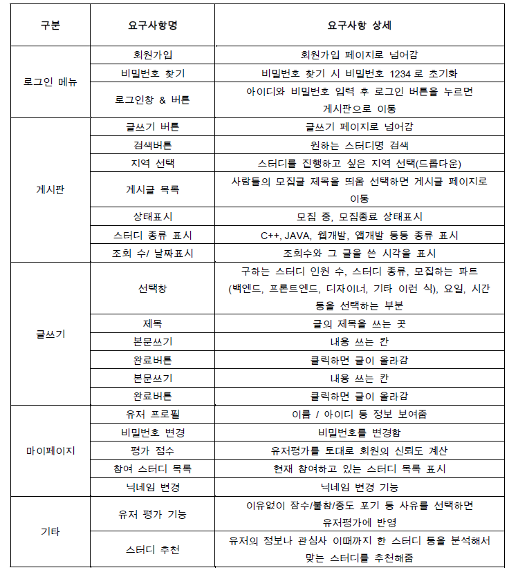
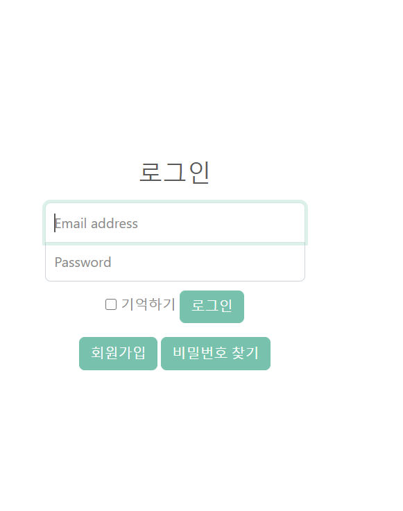
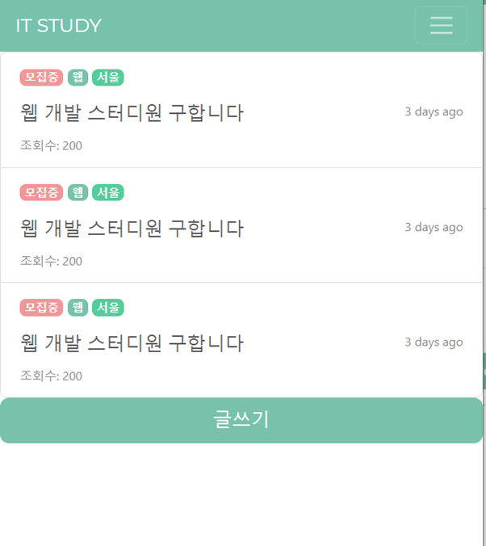
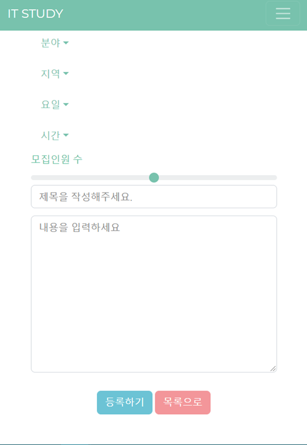

# study_web

## 프로젝트 소개 
스터디를 모집할 수 있는 사이트는 이미 있지만 IT 분야만 해도 아주 다양한 분야가 존재합니다.  
이에 IT 에 대한 스터디만 모집할 수 있는 개발자 스터디 사이트가 있으면 어떨까 하는 생각에 제작을 기획했습니다.  
다른 사이트와 차별적으로 유저 평가 기능이 있어 스터디 이탈률을 줄입니다.  

## 개발환경
- Django
- Python
- Bootstrap
- Visual Studio Code
- SqLite3

## 명세서

## 프로젝트 기능
1. 로그인화면  

2. 스터디 모집 게시판   
- DB에 저장된 글 정보를 가져와 출력합니다.  

3. 글쓰기 화면
- 글의 내용이 sqlite3 DB에 저장될 수 있도록 합니다.  

